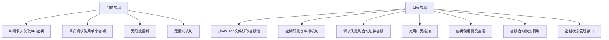
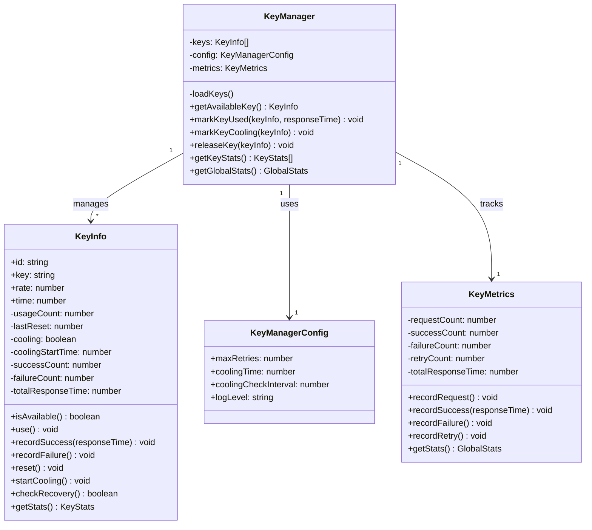
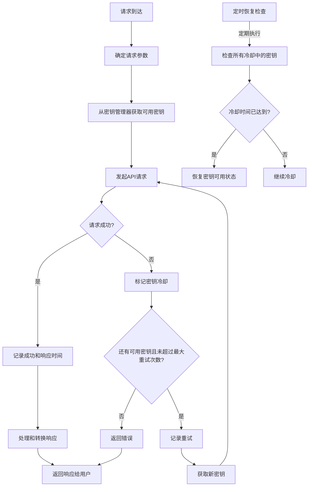
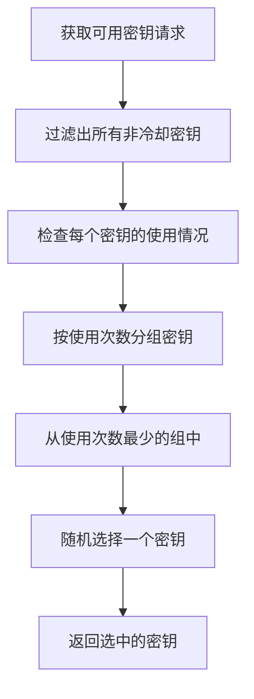
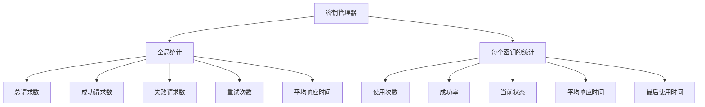

# API密钥池与限流控制重构方案

## 1. 需求概述

当前项目通过转发API请求来连接OpenAI格式的请求与Google Gemini API。目前API密钥是从请求中获取的，需要改进为从配置文件中读取并实现智能管理。

### 1.1 当前实现与目标实现对比



## 2. 系统设计

### 2.1 密钥管理器设计



### 2.2 处理流程设计



### 2.3 密钥选择策略



### 2.4 监控与统计



### 2.5 管理API

```mermaid
graph TD
    A[API端点] --> B[/api/keys/stats]
    A --> C[/api/keys/reset/:id]
    A --> D[/api/keys/config]
    
    B --> E[获取所有密钥状态和全局统计]
    C --> F[手动重置指定密钥状态]
    D --> G[获取或更新配置参数]
```

## 3. 具体实现计划

### 3.1 创建密钥管理器模块

创建一个新文件 `src/keyManager.mjs`：

```javascript
import fs from 'node:fs/promises';
import path from 'node:path';

// 配置默认值
const DEFAULT_CONFIG = {
  maxRetries: 3,           // 最大重试次数
  coolingTime: 300000,     // 冷却时间(毫秒) - 默认5分钟
  coolingCheckInterval: 60000, // 冷却恢复检查间隔(毫秒) - 默认1分钟
  logLevel: 'info'         // 日志级别: debug, info, warn, error
};

export class KeyManager {
  constructor(config = {}) {
    this.keyPool = [];
    this.keyMap = new Map(); // 通过ID快速查找密钥
    this.config = { ...DEFAULT_CONFIG, ...config };
    this.metrics = new KeyMetrics();
    
    // 启动冷却恢复检查定时器
    this.recoveryTimer = setInterval(() => {
      this.checkKeyRecovery();
    }, this.config.coolingCheckInterval);
    
    this.logger = this.createLogger();
  }
  
  // 创建适合环境的日志记录器
  createLogger() {
    return {
      debug: (...args) => this.config.logLevel === 'debug' && console.debug('[KeyManager]', ...args),
      info: (...args) => ['debug', 'info'].includes(this.config.logLevel) && console.info('[KeyManager]', ...args),
      warn: (...args) => ['debug', 'info', 'warn'].includes(this.config.logLevel) && console.warn('[KeyManager]', ...args),
      error: (...args) => console.error('[KeyManager]', ...args)
    };
  }
  
  // 加载密钥
  async loadKeys() {
    try {
      const keyFilePath = path.resolve('./key.json');
      const keyData = await fs.readFile(keyFilePath, 'utf-8');
      const keys = JSON.parse(keyData);
      
      this.keyPool = keys.map((k, index) => {
        const keyInfo = new KeyInfo(
          `key-${index}`, // 生成ID代替使用实际密钥，避免密钥泄露
          k.key,
          k.rate,
          k.time
        );
        this.keyMap.set(keyInfo.id, keyInfo);
        return keyInfo;
      });
      
      this.logger.info(`Loaded ${this.keyPool.length} API keys`);
      return true;
    } catch (error) {
      this.logger.error('Failed to load API keys:', error);
      return false;
    }
  }
  
  // 获取可用的密钥(使用组合策略)
  getAvailableKey() {
    this.metrics.recordRequest();
    
    // 过滤出所有可用的密钥
    const availableKeys = this.keyPool.filter(k => k.isAvailable());
    
    if (availableKeys.length === 0) {
      this.logger.warn('No available API keys!');
      throw new Error('所有API密钥都不可用，请稍后再试');
    }
    
    // 按使用次数分组
    const keysByUsage = new Map();
    let minUsage = Infinity;
    
    availableKeys.forEach(key => {
      const usage = key.usageCount;
      if (usage < minUsage) minUsage = usage;
      
      if (!keysByUsage.has(usage)) {
        keysByUsage.set(usage, []);
      }
      keysByUsage.get(usage).push(key);
    });
    
    // 从使用次数最少的组中随机选择
    const leastUsedKeys = keysByUsage.get(minUsage);
    const selectedKey = leastUsedKeys[Math.floor(Math.random() * leastUsedKeys.length)];
    
    selectedKey.use();
    this.logger.debug(`Selected API key: ${selectedKey.id}, usage: ${selectedKey.usageCount}`);
    
    return selectedKey;
  }
  
  // 标记密钥已成功使用
  markKeyUsed(keyInfo, responseTime) {
    if (!keyInfo) return;
    
    keyInfo.recordSuccess(responseTime);
    this.metrics.recordSuccess(responseTime);
    
    this.logger.debug(`Key ${keyInfo.id} used successfully, response time: ${responseTime}ms`);
  }
  
  // 标记密钥进入冷却状态
  markKeyCooling(keyInfo) {
    if (!keyInfo) return;
    
    keyInfo.recordFailure();
    keyInfo.startCooling();
    this.metrics.recordFailure();
    
    this.logger.warn(`Key ${keyInfo.id} marked as cooling`);
  }
  
  // 检查冷却中的密钥，尝试恢复
  checkKeyRecovery() {
    let recoveredCount = 0;
    
    this.keyPool.forEach(key => {
      if (key.cooling && key.checkRecovery()) {
        recoveredCount++;
        this.logger.info(`Key ${key.id} recovered from cooling`);
      }
    });
    
    if (recoveredCount > 0) {
      this.logger.info(`Recovered ${recoveredCount} keys from cooling`);
    }
  }
  
  // 获取所有密钥的统计信息
  getKeyStats() {
    return this.keyPool.map(key => key.getStats());
  }
  
  // 获取全局统计信息
  getGlobalStats() {
    return this.metrics.getStats();
  }
  
  // 重置指定密钥的状态
  resetKey(keyId) {
    const key = this.keyMap.get(keyId);
    if (key) {
      key.reset();
      this.logger.info(`Manually reset key ${keyId}`);
      return true;
    }
    return false;
  }
  
  // 获取或更新配置
  getConfig() {
    return { ...this.config };
  }
  
  updateConfig(newConfig) {
    this.config = { ...this.config, ...newConfig };
    
    // 如果冷却检查间隔有变化，重启定时器
    if (newConfig.coolingCheckInterval) {
      clearInterval(this.recoveryTimer);
      this.recoveryTimer = setInterval(() => {
        this.checkKeyRecovery();
      }, this.config.coolingCheckInterval);
    }
    
    this.logger.info('Config updated:', this.config);
    return this.config;
  }
  
  // 清理资源
  destroy() {
    if (this.recoveryTimer) {
      clearInterval(this.recoveryTimer);
    }
  }
}

// 表示单个API密钥及其状态
class KeyInfo {
  constructor(id, key, rate, time) {
    this.id = id;
    this.key = key;
    this.rate = rate;          // 时间窗口内的最大请求次数
    this.time = time * 1000;   // 时间窗口(秒转为毫秒)
    
    this.usageCount = 0;       // 当前时间窗口内的使用次数
    this.lastReset = Date.now(); // 上次重置计数器的时间
    this.cooling = false;      // 是否处于冷却状态
    this.coolingStartTime = 0; // 开始冷却的时间
    
    // 统计数据
    this.successCount = 0;
    this.failureCount = 0;
    this.totalResponseTime = 0;
    this.lastUsedTime = 0;
  }
  
  // 检查是否可用
  isAvailable() {
    // 如果在冷却中，不可用
    if (this.cooling) return false;
    
    // 检查是否需要重置计数器(新的时间窗口)
    const now = Date.now();
    if (now - this.lastReset >= this.time) {
      this.usageCount = 0;
      this.lastReset = now;
    }
    
    // 检查是否超过了限流阈值
    return this.usageCount < this.rate;
  }
  
  // 标记为已使用
  use() {
    this.usageCount++;
    this.lastUsedTime = Date.now();
  }
  
  // 记录成功请求
  recordSuccess(responseTime) {
    this.successCount++;
    this.totalResponseTime += responseTime;
  }
  
  // 记录失败请求
  recordFailure() {
    this.failureCount++;
  }
  
  // 重置状态
  reset() {
    this.usageCount = 0;
    this.lastReset = Date.now();
    this.cooling = false;
    this.coolingStartTime = 0;
  }
  
  // 进入冷却状态
  startCooling() {
    this.cooling = true;
    this.coolingStartTime = Date.now();
  }
  
  // 检查是否可以从冷却状态恢复
  checkRecovery() {
    if (!this.cooling) return false;
    
    const now = Date.now();
    const coolingDuration = now - this.coolingStartTime;
    
    // 检查是否已冷却足够时间(从KeyManager获取配置)
    const keyManager = globalThis.keyManager; // 从全局获取实例
    const coolingTime = keyManager?.config?.coolingTime || 300000; // 默认5分钟
    
    if (coolingDuration >= coolingTime) {
      this.cooling = false;
      this.usageCount = 0; // 重置使用计数
      this.lastReset = now;
      return true;
    }
    
    return false;
  }
  
  // 获取此密钥的统计信息
  getStats() {
    const totalRequests = this.successCount + this.failureCount;
    const successRate = totalRequests > 0 ? (this.successCount / totalRequests * 100).toFixed(2) : '100.00';
    const avgResponseTime = this.successCount > 0 ? (this.totalResponseTime / this.successCount).toFixed(2) : '0.00';
    
    return {
      id: this.id,
      // 不返回实际密钥，防止泄露
      rate: this.rate,
      timeWindow: this.time / 1000, // 转回秒
      currentUsage: this.usageCount,
      status: this.cooling ? 'cooling' : 'available',
      successRate: `${successRate}%`,
      totalRequests,
      successCount: this.successCount,
      failureCount: this.failureCount,
      avgResponseTime: `${avgResponseTime}ms`,
      lastUsed: this.lastUsedTime ? new Date(this.lastUsedTime).toISOString() : 'never',
      coolingTime: this.cooling ? (Date.now() - this.coolingStartTime) : 0
    };
  }
}

// 全局指标统计
class KeyMetrics {
  constructor() {
    this.requestCount = 0;
    this.successCount = 0;
    this.failureCount = 0;
    this.retryCount = 0;
    this.totalResponseTime = 0;
    this.startTime = Date.now();
  }
  
  recordRequest() {
    this.requestCount++;
  }
  
  recordSuccess(responseTime) {
    this.successCount++;
    this.totalResponseTime += responseTime;
  }
  
  recordFailure() {
    this.failureCount++;
  }
  
  recordRetry() {
    this.retryCount++;
  }
  
  getStats() {
    const totalTime = Date.now() - this.startTime;
    const totalRequests = this.successCount + this.failureCount;
    const successRate = totalRequests > 0 ? (this.successCount / totalRequests * 100).toFixed(2) : '100.00';
    const avgResponseTime = this.successCount > 0 ? (this.totalResponseTime / this.successCount).toFixed(2) : '0.00';
    
    return {
      uptime: this.formatDuration(totalTime),
      totalRequests: this.requestCount,
      successCount: this.successCount,
      failureCount: this.failureCount,
      retryCount: this.retryCount,
      successRate: `${successRate}%`,
      avgResponseTime: `${avgResponseTime}ms`
    };
  }
  
  formatDuration(ms) {
    const seconds = Math.floor(ms / 1000);
    const minutes = Math.floor(seconds / 60);
    const hours = Math.floor(minutes / 60);
    const days = Math.floor(hours / 24);
    
    return `${days}d ${hours % 24}h ${minutes % 60}m ${seconds % 60}s`;
  }
}

// 创建单例实例
const keyManager = new KeyManager();
globalThis.keyManager = keyManager; // 设置全局引用，方便KeyInfo访问配置
export default keyManager;
```

### 3.2 修改 handleCompletions 方法

修改 `src/worker.mjs` 中的 `handleCompletions` 函数：

```javascript
import keyManager from './keyManager.mjs';

// 初始化密钥管理器
let keysLoaded = false;
async function ensureKeysLoaded() {
  if (!keysLoaded) {
    await keyManager.loadKeys();
    keysLoaded = true;
  }
}

async function handleCompletions(req, _) { // 忽略传入的apiKey参数
  await ensureKeysLoaded();
  
  let model = DEFAULT_MODEL;
  switch(true) {
    case typeof req.model !== "string":
      break;
    case req.model.startsWith("models/"):
      model = req.model.substring(7);
      break;
    case req.model.startsWith("gemini-"):
    case req.model.startsWith("learnlm-"):
      model = req.model;
  }
  
  const TASK = req.stream ? "streamGenerateContent" : "generateContent";
  let url = `${BASE_URL}/${API_VERSION}/models/${model}:${TASK}`;
  if (req.stream) { url += "?alt=sse"; }
  
  let response;
  let usedKey;
  let attempts = 0;
  const maxRetries = keyManager.getConfig().maxRetries;
  const startTime = Date.now();
  
  while (attempts <= maxRetries) { // <= 因为第一次不算重试
    try {
      // 获取可用密钥
      usedKey = keyManager.getAvailableKey();
      
      const requestStartTime = Date.now();
      
      // 发起请求
      response = await fetch(url, {
        method: "POST",
        headers: makeHeaders(usedKey.key, { "Content-Type": "application/json" }),
        body: JSON.stringify(await transformRequest(req)),
      });
      
      const responseTime = Date.now() - requestStartTime;
      
      // 如果响应不成功，标记密钥冷却并重试
      if (!response.ok) {
        keyManager.markKeyCooling(usedKey);
        attempts++;
        
        if (attempts > maxRetries) {
          throw new HttpError(`API请求失败 (${response.status}): ${await response.text()}`, response.status);
        }
        
        keyManager.metrics.recordRetry();
        continue;
      }
      
      // 记录成功使用
      keyManager.markKeyUsed(usedKey, responseTime);
      
      // 处理成功，退出循环
      break;
    } catch (error) {
      // 请求异常，标记密钥冷却
      if (usedKey) {
        keyManager.markKeyCooling(usedKey);
      }
      attempts++;
      
      // 如果达到最大重试次数，抛出异常
      if (attempts > maxRetries) {
        throw new HttpError(`处理请求出错: ${error.message}`, error.status || 500);
      }
      
      keyManager.metrics.recordRetry();
    }
  }
  
  const totalTime = Date.now() - startTime;
  console.info(`Completed request in ${totalTime}ms with ${attempts} retries`);
  
  // 处理响应体
  let body = response.body;
  if (response.ok) {
    let id = generateChatcmplId();
    if (req.stream) {
      body = response.body
        .pipeThrough(new TextDecoderStream())
        .pipeThrough(new TransformStream({
          transform: parseStream,
          flush: parseStreamFlush,
          buffer: "",
        }))
        .pipeThrough(new TransformStream({
          transform: toOpenAiStream,
          flush: toOpenAiStreamFlush,
          streamIncludeUsage: req.stream_options?.include_usage,
          model, id, last: [],
        }))
        .pipeThrough(new TextEncoderStream());
    } else {
      body = await response.text();
      body = processCompletionsResponse(JSON.parse(body), model, id);
    }
  }
  
  return new Response(body, fixCors(response));
}
```

### 3.3 修改其他处理方法

类似地修改 `handleEmbeddings` 和 `handleModels` 方法。

### 3.4 添加管理API端点

在 `src/worker.mjs` 的路由处理部分添加管理API:

```javascript
const { pathname } = new URL(request.url);
switch (true) {
  case pathname.endsWith("/chat/completions"):
    // 原有处理...
  case pathname.endsWith("/embeddings"):
    // 原有处理...
  case pathname.endsWith("/models"):
    // 原有处理...
  
  // 添加新的管理API端点
  case pathname.endsWith("/admin/keys/stats"):
    assert(request.method === "GET");
    return handleKeyStats()
      .catch(errHandler);
  
  case pathname.match(/\/admin\/keys\/reset\/\w+$/):
    assert(request.method === "POST");
    const keyId = pathname.split('/').pop();
    return handleKeyReset(keyId)
      .catch(errHandler);
  
  case pathname.endsWith("/admin/keys/config"):
    if (request.method === "GET") {
      return handleGetConfig()
        .catch(errHandler);
    } else if (request.method === "POST") {
      return handleUpdateConfig(await request.json())
        .catch(errHandler);
    }
    throw new HttpError("Method not allowed", 405);
  
  default:
    throw new HttpError("404 Not Found", 404);
}

// 处理函数
async function handleKeyStats() {
  await ensureKeysLoaded();
  const stats = {
    keys: keyManager.getKeyStats(),
    global: keyManager.getGlobalStats()
  };
  return new Response(JSON.stringify(stats, null, 2), fixCors({
    status: 200,
    headers: { "Content-Type": "application/json" }
  }));
}

async function handleKeyReset(keyId) {
  await ensureKeysLoaded();
  const success = keyManager.resetKey(keyId);
  return new Response(JSON.stringify({ success }), fixCors({
    status: success ? 200 : 404,
    headers: { "Content-Type": "application/json" }
  }));
}

async function handleGetConfig() {
  await ensureKeysLoaded();
  const config = keyManager.getConfig();
  return new Response(JSON.stringify(config, null, 2), fixCors({
    status: 200,
    headers: { "Content-Type": "application/json" }
  }));
}

async function handleUpdateConfig(newConfig) {
  await ensureKeysLoaded();
  const config = keyManager.updateConfig(newConfig);
  return new Response(JSON.stringify(config, null, 2), fixCors({
    status: 200,
    headers: { "Content-Type": "application/json" }
  }));
}
```

## 4. 环境适配方案

为了确保在不同环境中正常工作，我们需要处理文件读取的差异：

```javascript
// 在keyManager.mjs中

// 适配不同环境的文件读取
async function readKeyFile() {
  const keyFilePath = './key.json';
  
  try {
    // 尝试使用Node.js的fs模块
    if (typeof process !== 'undefined' && process.versions && process.versions.node) {
      const fs = await import('node:fs/promises');
      const path = await import('node:path');
      const resolvedPath = path.resolve(keyFilePath);
      return await fs.readFile(resolvedPath, 'utf-8');
    }
    // 尝试使用Deno的API
    else if (typeof Deno !== 'undefined') {
      return await Deno.readTextFile(keyFilePath);
    }
    // 尝试使用Bun的API
    else if (typeof Bun !== 'undefined') {
      return await Bun.file(keyFilePath).text();
    }
    // 网络环境，使用fetch
    else {
      const response = await fetch(keyFilePath);
      if (!response.ok) {
        throw new Error(`Failed to fetch key file: ${response.status}`);
      }
      return await response.text();
    }
  } catch (error) {
    console.error('Error reading key file:', error);
    throw error;
  }
}
```

## 5. 测试策略

### 5.1 单元测试

为密钥管理器创建单元测试，验证：

- 密钥轮换策略选择正确的密钥
- 冷却和恢复机制正常工作
- 限流逻辑正确计算

### 5.2 集成测试

- 测试密钥管理器与请求处理的集成
- 验证失败重试和自动切换密钥

### 5.3 负载测试

- 模拟高并发请求，验证限流和冷却机制
- 测试边缘情况，如所有密钥都达到限制

### 5.4 API测试

- 测试管理API端点功能正常

## 6. 实现时间估计

| 任务 | 时间估计 |
|-----|---------|
| 创建密钥管理器模块 | 4小时 |
| 修改请求处理逻辑 | 2小时 |
| 实现管理API | 2小时 |
| 环境适配 | 2小时 |
| 测试和调试 | 4小时 |
| 文档和部署 | 1小时 |
| **总计** | **15小时** |

## 7. 后续优化方向

1. 实现密钥使用统计的持久化存储
2. 添加更复杂的密钥选择策略，如基于成功率的选择
3. 增强监控功能，如与Prometheus集成
4. 开发更完善的管理界面
5. 实现更细粒度的权限控制